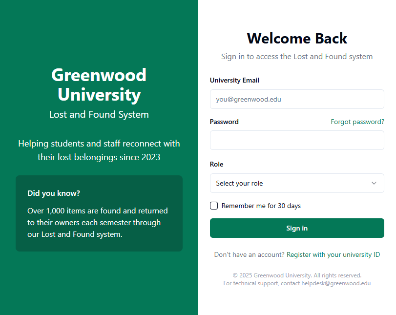
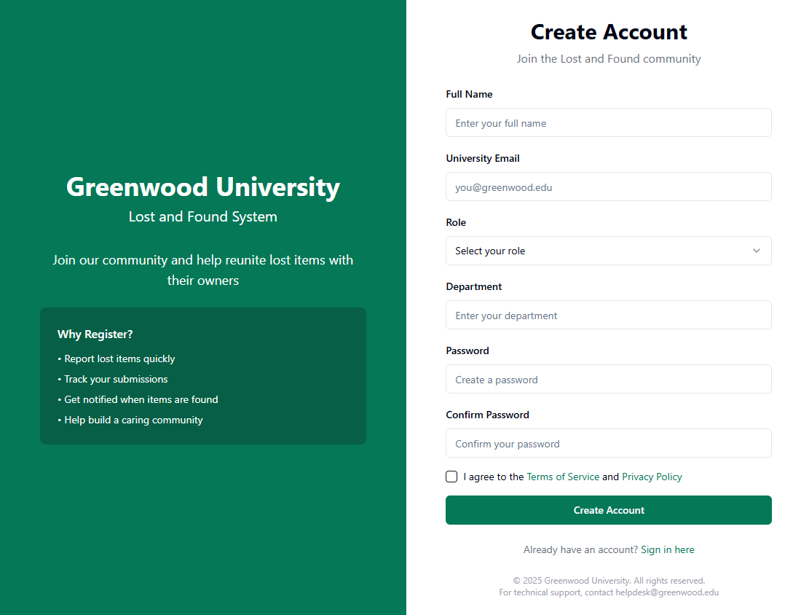
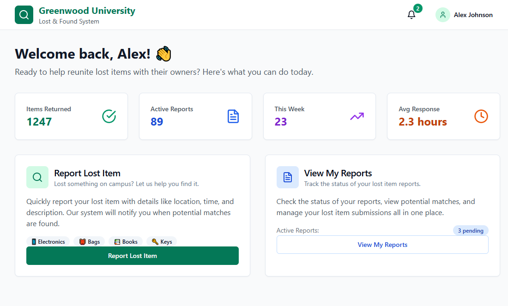
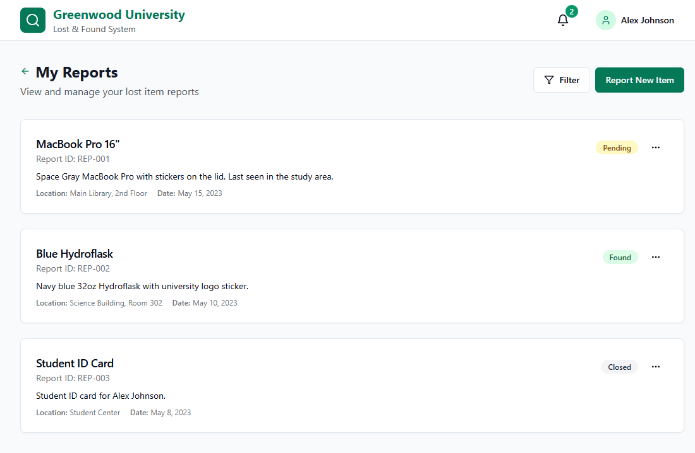
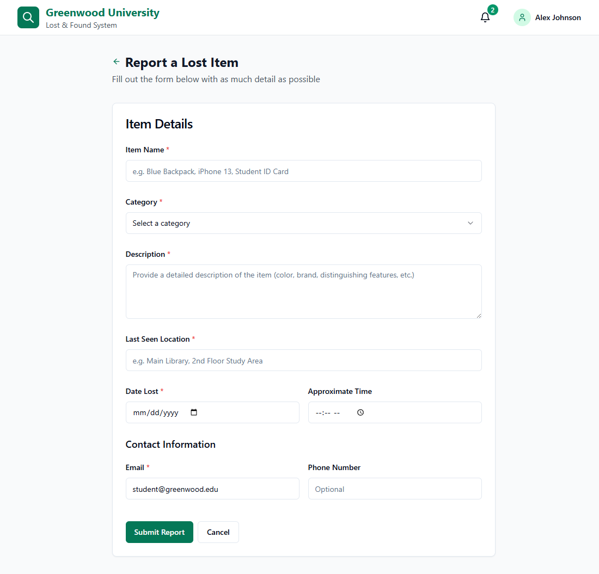
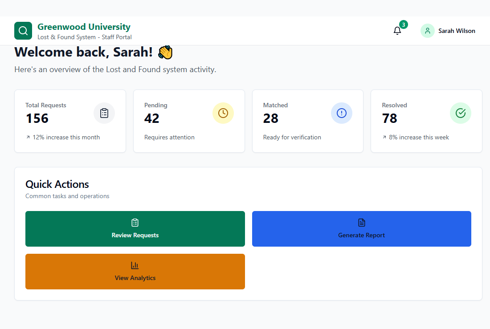
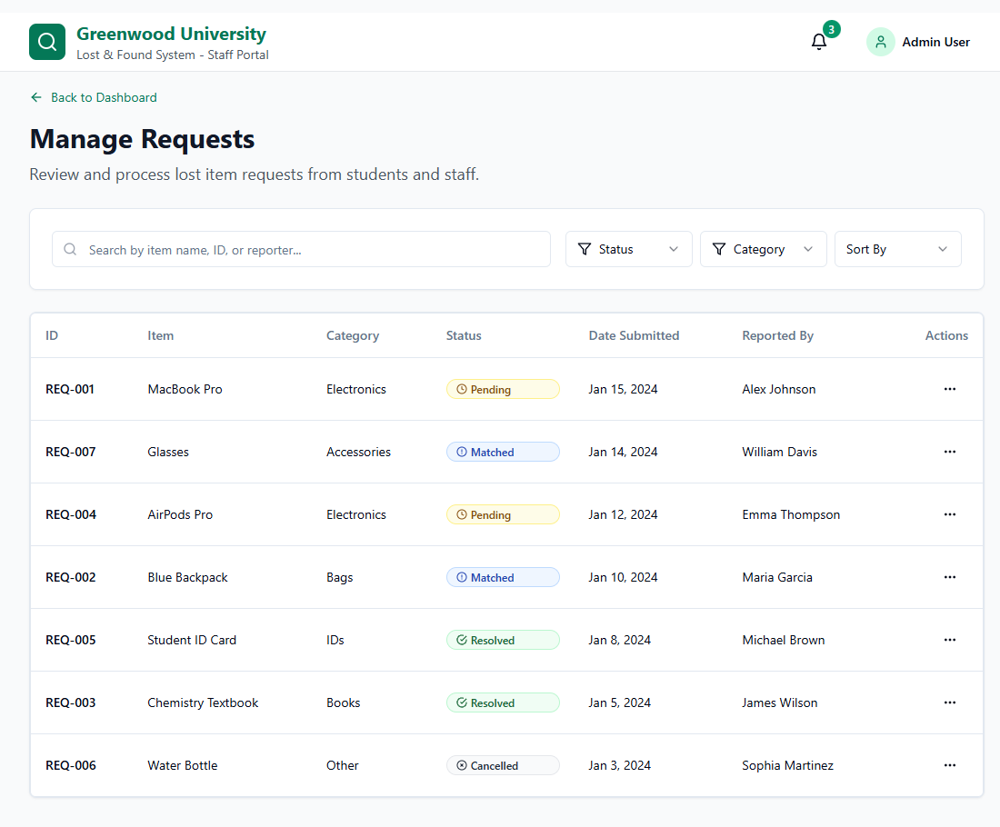
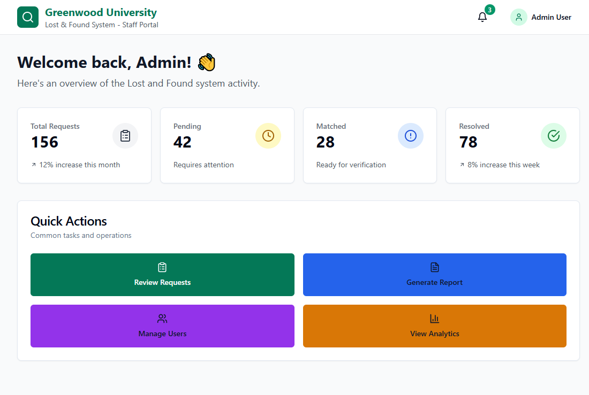
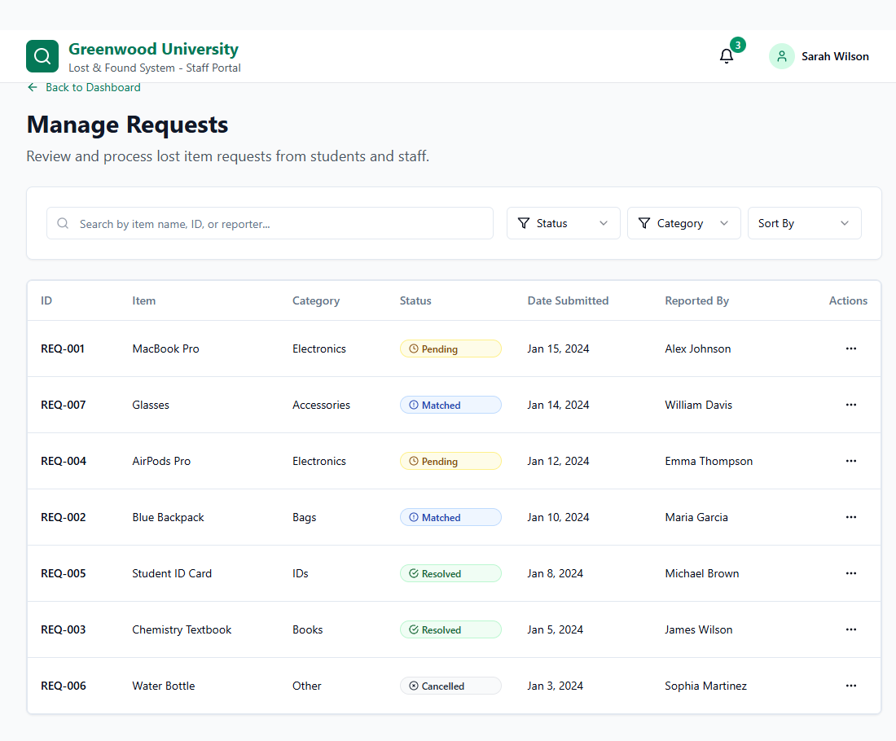

# Lost and Found Application - Frontend

A comprehensive React TypeScript application for managing lost and found items in an educational institute. This system provides role-based access for students, staff, and administrators with a clean, responsive interface.

## 🎯 Features

### Authentication

- Secure login and registration system
- Role-based access control (Admin, Staff, Student)
- JWT token simulation with localStorage
- Protected routes with role restrictions


### Admin Features

- Dashboard with statistics and activity overview
- Request management (approve/reject lost items)
- User management (view, edit, activate/deactivate users)
- Analytics and reporting capabilities


### Staff Features

- Dashboard with request statistics
- Request management capabilities
- Filter and search functionality


### Student Features

- Personal dashboard
- Report lost items form with validation
- View and track personal reports/requests
- Update or cancel submitted reports


## 🛠️ Tech Stack

- **React 18** with TypeScript
- **React Router v6** for navigation
- **Tailwind CSS** for styling
- **Shadcn/UI** component library
- **Lucide React** for icons
- **React Hook Form** for form handling
- **Local Storage** for state persistence


## 📋 Project Structure

```plaintext
src/
├── components/         # Reusable UI components
│   ├── ui/             # Shadcn UI components
│   └── ...
├── contexts/           # React context providers
│   └── AuthContext.tsx # Authentication context
├── pages/              # Page components
│   ├── Login.tsx
│   ├── RegisterPage.tsx
│   ├── StudentDashboard.tsx
│   ├── AdminDashboard.tsx
│   └── ...
├── utils/              # Utility functions
│   └── auth.ts         # Authentication utilities
├── App.tsx             # Main application component
└── main.tsx           # Application entry point
```

🖼️ Screenshots

🔐 Login Page


📝 Register Page


🧑‍🎓 Student Dashboard


📋 My Reports (Student)


📝 Report Lost Item (Student)


👩‍🏫 Staff Dashboard


📥 Staff Requests Page


🧑‍💼 Admin Dashboard


📩 Admin Requests


👥 Admin User Management


## 🚀 Installation and Setup

1. Clone the repository:


```shellscript
git clone https://github.com/Radun111/lost-and-found-frontend
cd lost-and-found-frontend
```

2. Install dependencies:


```shellscript
npm install
```

3. Start the development server:


```shellscript
npm run dev
```

4. Build for production:


```shellscript
npm run build
```

## 🔑 Test Credentials

Use these credentials to test different user roles:

| Role | Email | Password
|-----|-----|-----
| Admin | [admin@greenwood.edu](mailto:admin@greenwood.edu) | password123
| Staff | [staff@greenwood.edu](mailto:staff@greenwood.edu) | password123
| Student | [student@greenwood.edu](mailto:student@greenwood.edu) | password123


