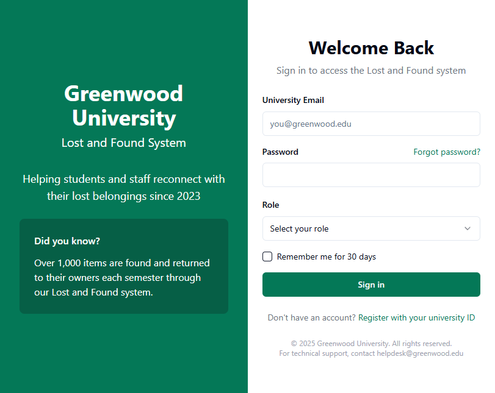
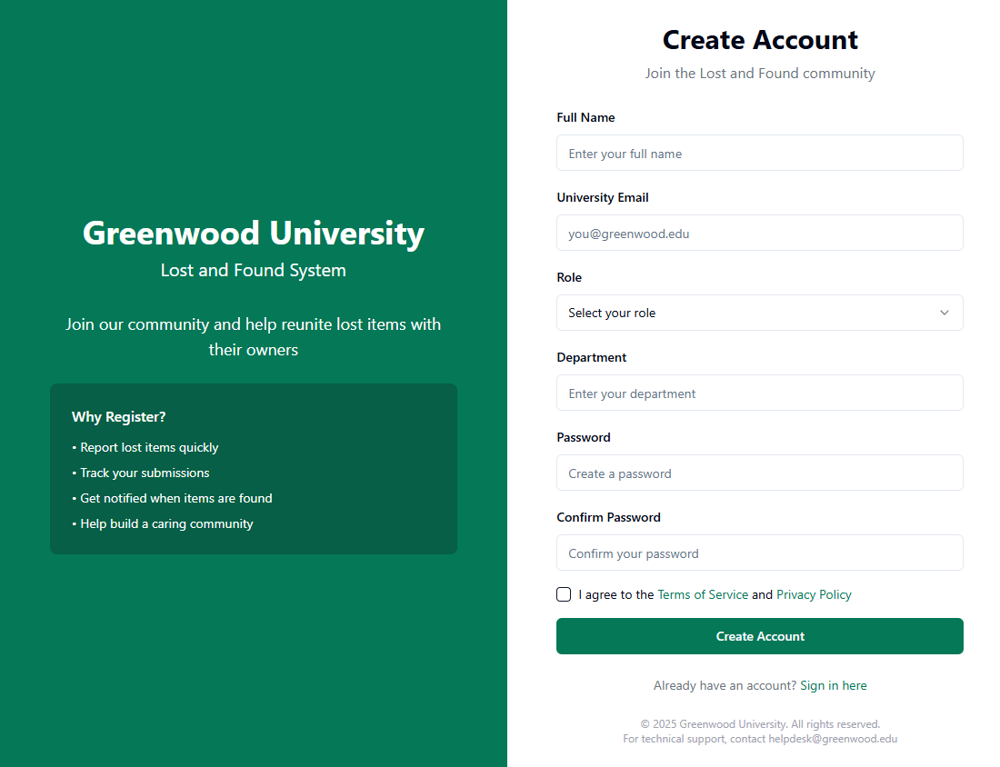
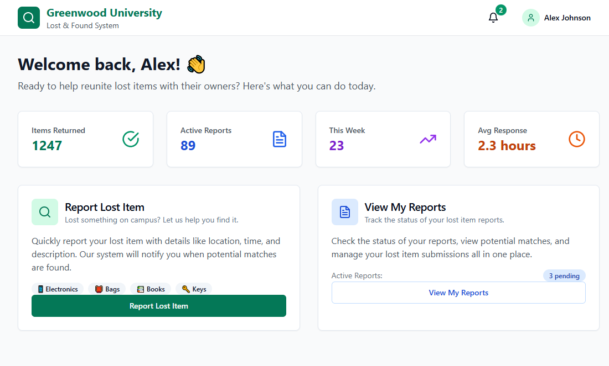
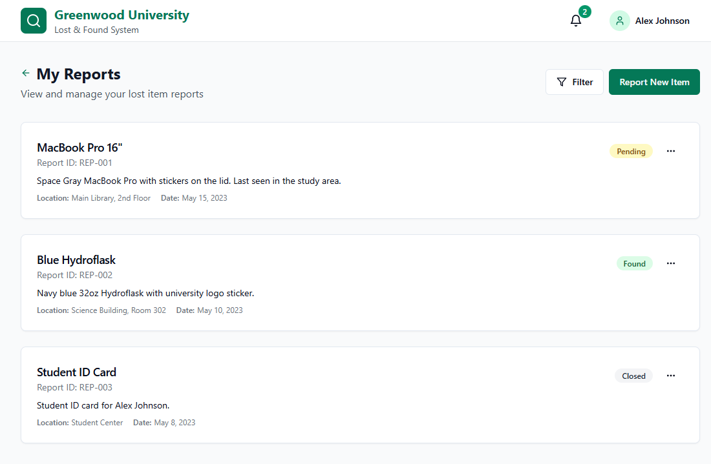
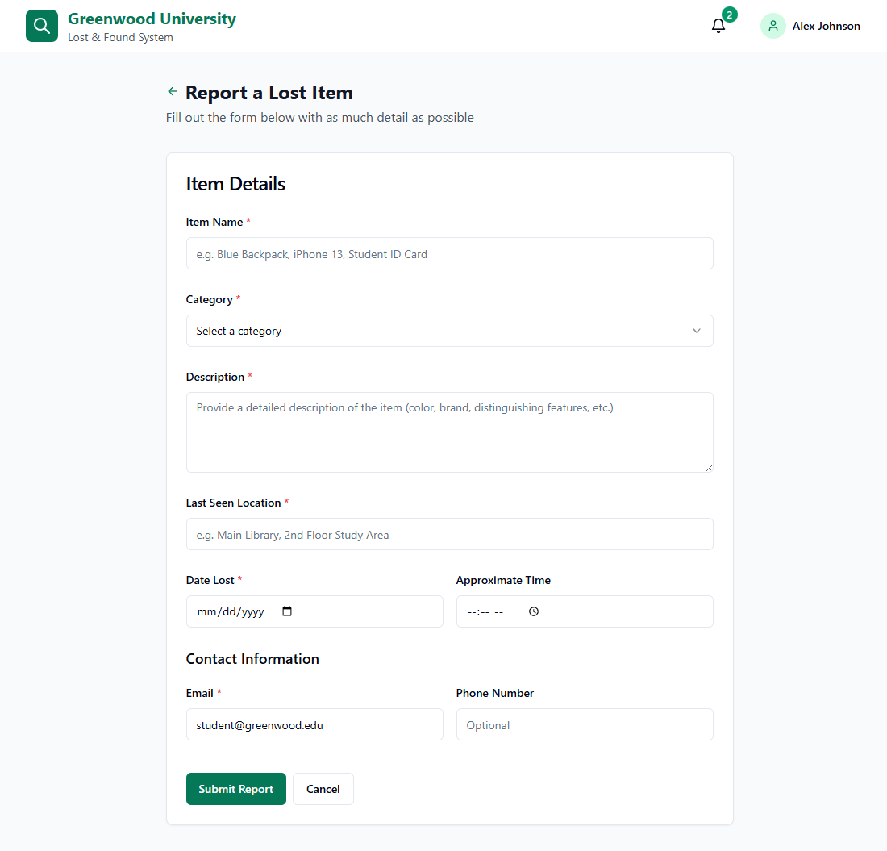
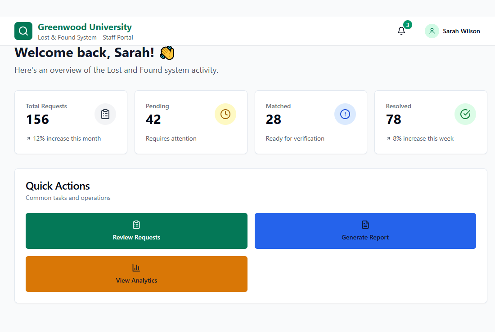
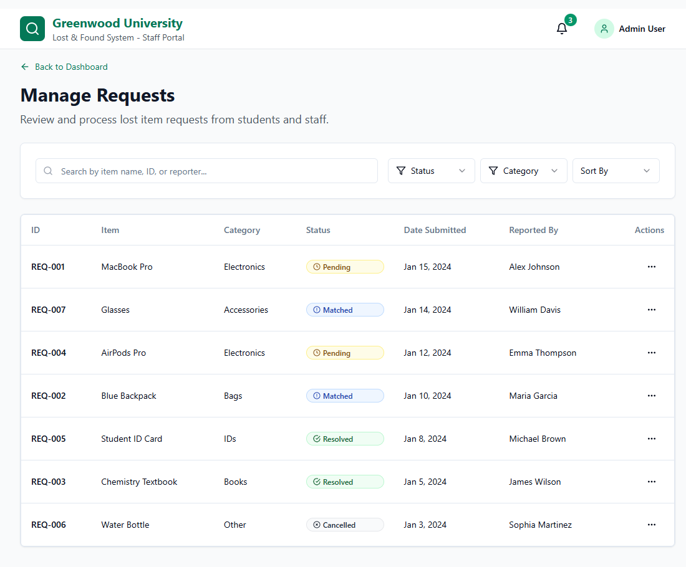
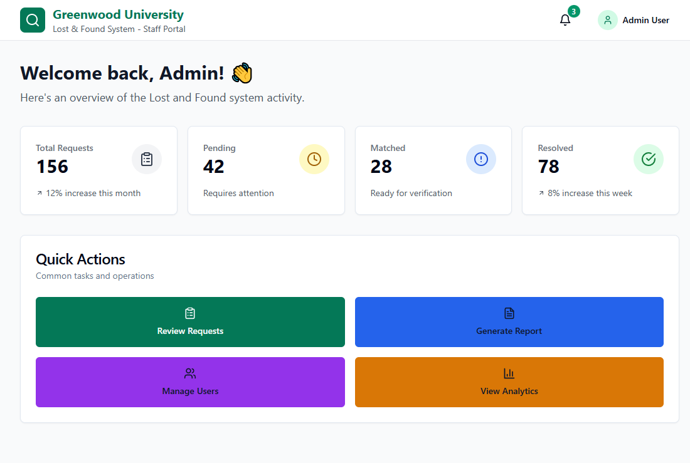
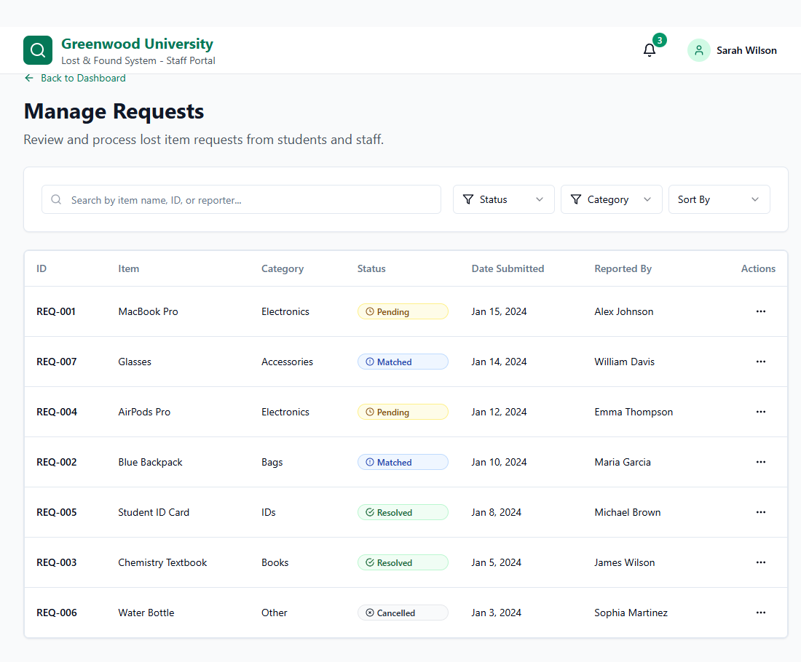
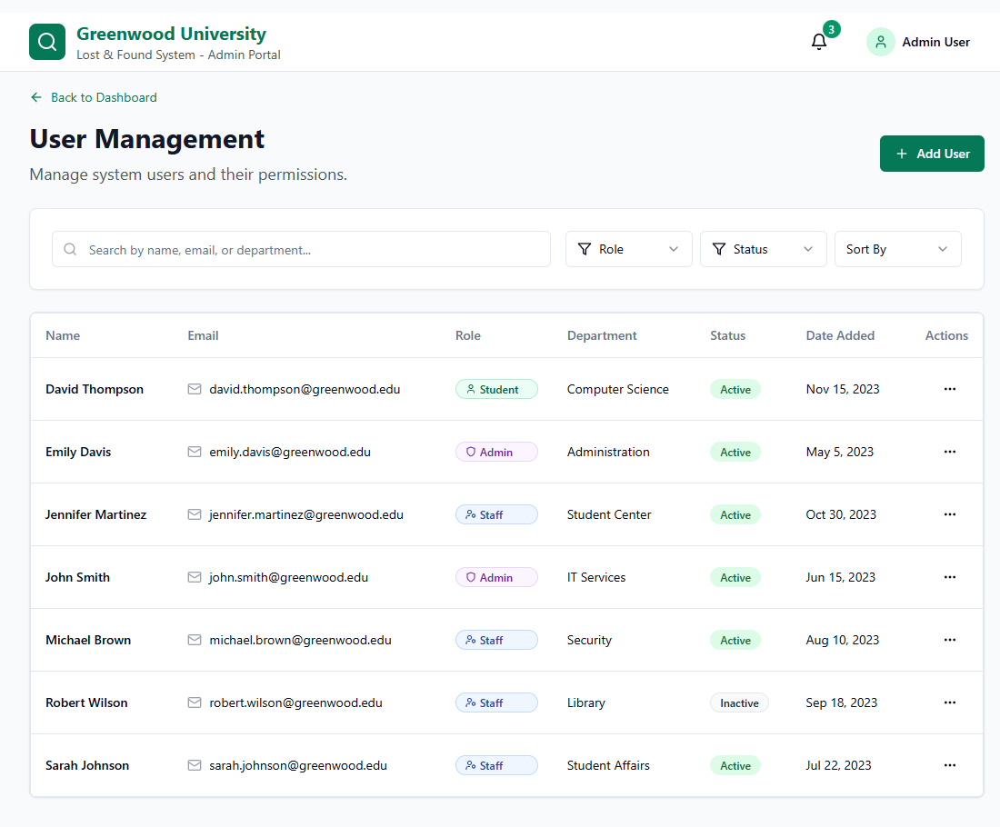

# 🎒 Campus Lost & Found — Frontend

A React + TypeScript web app for managing lost and found items at an educational institute. Students report lost items and track their requests, while staff and admins review requests and manage users, each with their own dashboard.

Built as Assignment 1 for the **CMJD** program at **IJSE** (Batch 108/109).

🔗 **Backend API:** [campus-lost-and-found.](https://github.com/Radun111/campus-lost-and-found.) (Spring Boot + MySQL)


---

## 🎯 Features

### Authentication

- Secure login and registration system
- Role-based access control (Admin, Staff, Student)
- JWT tokens from the backend, stored in localStorage and refreshed automatically when they expire
- Protected routes with role restrictions

### Admin Features

- Dashboard with statistics and activity overview
- Request management (approve/reject lost items)
- User management (view, edit, activate/deactivate users)
- Analytics and reporting capabilities

### Staff Features

- Dashboard with request statistics
- Request management capabilities
- Filter and search functionality

### Student Features

- Personal dashboard
- Report lost items form with validation
- View and track personal reports/requests
- Update or cancel submitted reports

## 🛠️ Tech Stack

- **React 18** with TypeScript
- **Vite** for development and builds
- **React Router v6** for navigation
- **Tailwind CSS** for styling
- **shadcn/ui** component library
- **Lucide React** for icons
- **Axios** for API calls, with an interceptor that attaches the JWT and refreshes it

## 📋 Project Structure

```plaintext
src/
├── components/         # Reusable UI components
│   ├── admin/          # Admin layout, dashboard, users and requests
│   └── ui/             # shadcn/ui components
├── contexts/           # React context providers
│   └── AuthContext.tsx # Authentication context
├── pages/              # Page components (Login, Register, dashboards, reports…)
├── services/           # API calls (auth, items, requests)
├── types/              # TypeScript types
├── utils/              # Utility functions
├── App.tsx             # Routes
└── main.tsx            # Application entry point
```

## 🖼️ Screenshots

### 🔐 Login Page


### 📝 Register Page


### 🧑‍🎓 Student Dashboard


### 📋 My Reports (Student)


### 📝 Report Lost Item (Student)


### 👩‍🏫 Staff Dashboard


### 📥 Staff Requests Page


### 🧑‍💼 Admin Dashboard


### 📩 Admin Requests


### 👥 Admin User Management


## 🚀 Installation and Setup

1. Start the [backend API](https://github.com/Radun111/campus-lost-and-found.) first. It runs on `http://localhost:8080`.

2. Clone this repository:
   ```bash
   git clone https://github.com/Radun111/lost-and-found-frontend
   cd lost-and-found-frontend
   ```

3. Install dependencies:
   ```bash
   npm install
   ```

4. Check the API address in `.env`:
   ```env
   REACT_APP_API_URL=http://localhost:8080/api
   ```

5. Start the development server on port 3000 (the port the backend allows):
   ```bash
   npm run dev -- --port 3000
   ```

6. Build for production:
   ```bash
   npm run build
   ```

## 🔑 Test Credentials

Use these credentials to test different user roles:

| Role | Email | Password |
|---|---|---|
| Admin | admin@greenwood.edu | password123 |
| Staff | staff@greenwood.edu | password123 |
| Student | student@greenwood.edu | password123 |

## 👩‍💻 Author

**Raduni Thesanya** · [GitHub](https://github.com/Radun111) · [LinkedIn](https://www.linkedin.com/in/raduni-thesanya/)
